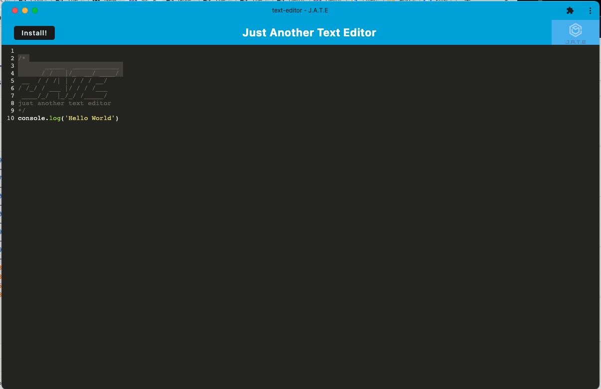
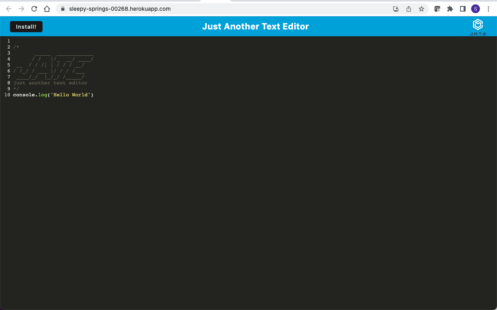

# text_editor

  

## Description
This application is a text editor that not only runs in the browser, but can also be installed and ran offline if needed. Your data will be saved across desktop and browser versions.

## Table of Contents
- [Installation](#installation)
- [Usage](#usage)
- [Questions](#questions)
- [License](#license)  

## Installation
You will need to run npm i and npm run install from the root level and the client/server levels as well. This should install all the required third party packages. 

## Usage
  This application runs in the browser. Please use the included Heroku link below to get started. You also have an option to install the application directly to your desktop to use offline in needed. If you are running this application from the terminal, please see the root package.json to get the script commands you would like to run.
  
  - Once you open the application you will see a screen that looks similar to VS code. Here you can type any code you would like to save to use for later and it will be saved on this page until you delete it.
  - In the top left corner you will see the install button, you can click on this and it will prompt you to install. Once installed the application will be accessable from your desktop.

  Desktop version

browers version

## Links to Application

<a href="https://github.com/smturner/text_editor">GitHub Repo</a>

<a href="https://sleepy-springs-00268.herokuapp.com">Deployed Webpage </a>

## Questions  
If you have any questions about this project, please email me directly at turnerSarah228@gmail.com.

You can view more of my projects at https://github.com/smturner.

## License
Copyright (c) 2022 Sarah Turner

This application is licensed by MIT. For more information on this license, visit <a href= "(https://opensource.org/licenses/MIT)">Open Source MIT</a>.  